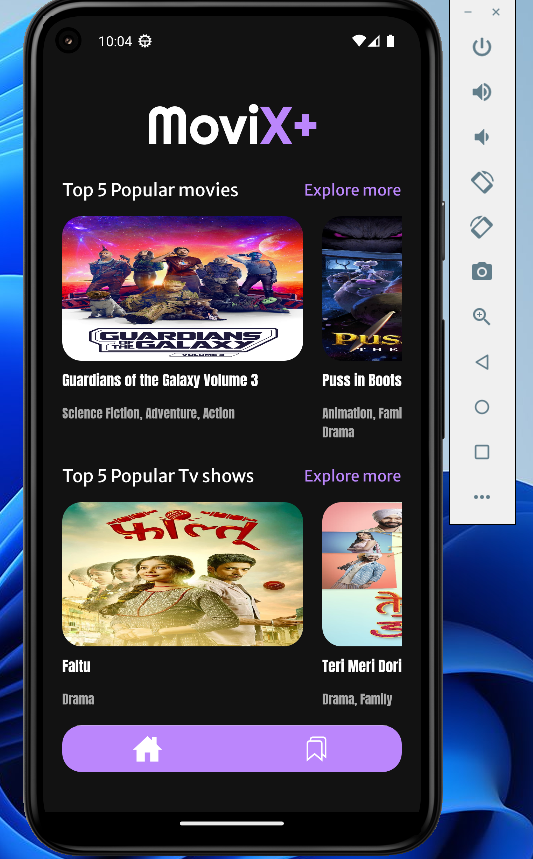
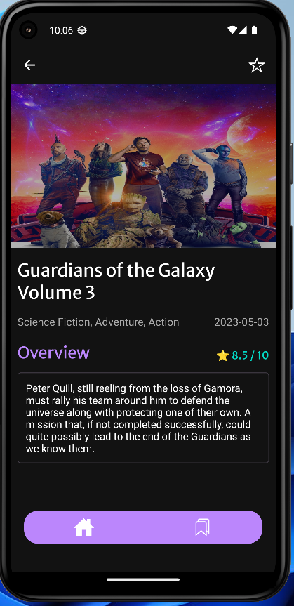

# Movix  🎬

Movix is a personalized movie recommendation engine that helps users find movies they will love based on their individual preferences. This project is built using React Native and utilizes the TMDB API to provide movie recommendations.


## Features
🟣 Personalized movie recommendations based on user preferences.

🟣 Search for movies by title, genre, or release year.

🟣 View movie / tv show details, including plot summary, cast, and trailer.

🟣 Add movies / tv shows to the favorites.






## Technologies

👉 REACT Native

👉 Expo CLI

## Implementation remarks

```
~$: npm i
~$: npm start
```

1️⃣ I have added to the project 5 main components that will help me perform the task in a simpler:

1. Login.js - This is a component that responsible for rendering the login page of the application.
2. Explore.js - This component is responsible for displaying a list of items available for exploration. This could include movies and tv shows. It typically uses the TMDB API to fetch the list of items and renders them as a list or a grid.
3. AllItems.js - This component displays a list of all items available in the application. This component is typically used when the user wants to browse through all available items in a particular category, such as all movies or all books. It may also provide filtering and sorting options to help the user find what they are looking for.
4. ItemDetails.js - This component is responsible for rendering the details of a particular item. For example, if the user clicks on a movie or book in the Explore.js or AllItems.js component, this component would be responsible for displaying the details of that movie or book. This typically includes a brief summary, ratings, release date and other relevant information.
5. Favorite.js - This component displays a list of the user's favorite items. It is typically used to keep track of items the user has liked or rated highly, so they can easily access them later. This component may also provide options for the user to add or remove items from their favorites list.

2️⃣ I implemented the navigation using react navigation libraries (Native Stack & Bottom Tabs).

3️⃣ The rating color adjusted by the average rating : 

🔴 When the rating is a number below 6.

🟡 When the rating is a number in the range [6,8).

🟢 When the rating is a number in the range [8,10].

## External style libraries

🔹 Google fonts

## Database I used

🔹 The Movie Database (TMDB)

## Usage :

```
~$: a
```
🔹 To execute in web-browser:
```
~$: w
```
🔹 Notes:

- The best quality is in PIXEL5 and PIXEL6 Devices.

- Recommendation: The built-in network of the T-MOBILE emulator is better than AndroidWifi

## for any questions

```
if(haveAnyQuestions === true){
    let yourName = ".......", question = ".......";
    sendEmailToMe(yourName,question,odedatias8115@gmail.com);
}
```
